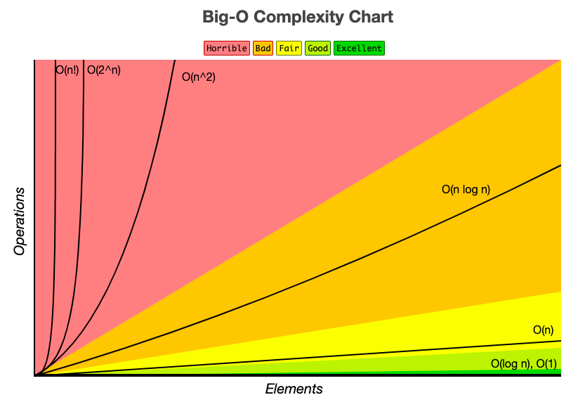

#  Python Data Structure Tutorial

Welcome to the Python Data Structure Tutorial
# 
#### What is data structure?
#### Data structure is a system to manage, organize, and store the data in an effieicnt way. 
[more](https://en.wikipedia.org/wiki/Data_structure#:~:text=In%20computer%20science%2C%20a%20data,be%20applied%20to%20the%20data.)
#
#### Why do we need to learn data structure? 
It is a important tool for programmers to anayze the cost of the algorithm. Every good programmer should learn about it!
#
## Topics 
* [Stack](1-topic.md)
* [Set](2-topic.md)
* [Tree](3-topic.md)
#
## Knowledge Base
#### Python Built_in List Data Type
* [append()](https://www.w3schools.com/python/ref_list_append.asp)
* [pop()](https://www.w3schools.com/python/ref_list_pop.asp)
* [insert()](https://www.w3schools.com/python/ref_list_insert.asp)
* [indexing](https://realpython.com/lessons/indexing-and-slicing/) 
[more about list](https://www.python.org/dev/peps/pep-3128/)
#
#### Runtime Basics - The performance of the data structure

1. What is Bog O notation 
How efficient is an algorithm or a pice of code? 
Big O notation is a methematiccal method of specifying the performance of an algorithm to answer that question. It predicts the execution time as the size of the problem grows. 

- The letter O is used because the growth rate of a function is also referred to as the order of the function
- The letter n represents the input size
- The O() represents the complexity of the algorithm regarding the input size

2. The performance 

|Performance |Run Time|Description|
|-----|----|----|
|O(1) | constant  |..| 
|O(log(n)) | log  |..|
|O(n) | linear  |..|
|O(n^2) | quadratic  |..|
|O(2^n) | exponential  |..|

 (https://www.cs.umd.edu/class/summer2015/cmsc132/lectures/lecture18/Big-O.pdf)

## Tools and Resources
[Big O ](https://www.freecodecamp.org/news/big-o-notation-why-it-matters-and-why-it-doesnt-1674cfa8a23c/)
[Big O Diagram](https://www.bigocheatsheet.com/)

#
## Contact
Chloe Huang

chloe.huangts@gmail.com

BYU-I CSE 212
