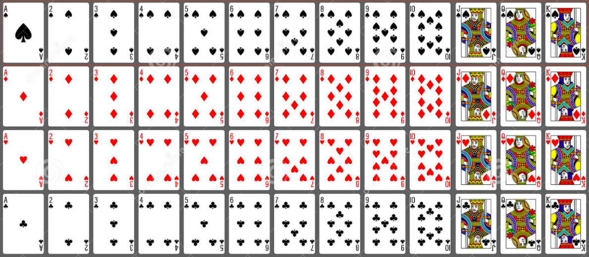
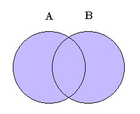
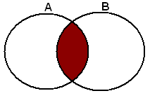

<!-- 
What is the purpose of the data structure?

What is the performance of the data structure (you will need to talk about big O notation)?

What kind of problems can be solved using the data structure?

How would the data structure be used in Python (in some cases you will need to discuss recursion)?

What kind of errors are common when using the data structure? -->

# Set

### What is Set
A set is an unordered collection of simple objects in Python. 
In addition to being iterable and mutable, a set has no duplicate elements.
 Any set defined in Python is an instance of the set class.

Compared to a list, a set is advantageous by virtue of having a highly optimized method for
 checking whether some element is contained in the set or not. The general syntax of a set is:

* Sets are unordered
* No duplicate objects, meaning it only contains unique objects
#
### How does it work
1. Create a set
```python
  
# create a set
myset = set(["a", "b", "c"])
print(myset)
```

Output:
```
{'c', 'b', 'a'}
```
#
2. Add

Use add function to add an element to a set
```python
# Adding element to the set
myset.add("d")
print(myset)
```
Output:
```
{'d', 'c', 'b', 'a'}
```
#
3. Union 
Two sets can be merged using union() function or | operator. 
Both Hash Table values are accessed and traversed with merge operation perform on them to combine the elements, 
at the same time duplicates are removed. Time Complexity of this is O(len(s1) + len(s2)) where s1 and s2 are two sets whose union needs to be done.



```python
A={1,2,3,4,5}
B={4,5,6,7,8}

# Three ways to union A and B

print(A|B)
set([1, 2, 3, 4, 5, 6, 7, 8])

A.union(B)
set([1, 2, 3, 4, 5, 6, 7, 8])

B.union(A)
set([1, 2, 3, 4, 5, 6, 7, 8])

```
#
4. Intersection

This can be done through intersection() or & operator. Common Elements are selected.



```python
A={1,2,3,4,5}
B={4,5,6,7,8}

# Three ways to union A and B

print(A&B)
set([4, 5])

 A.intersection(B)
set([4, 5])

B.intersection(A)
set([4, 5])
```
#
5. Difference

Difference of A and B (A — B) is a set of elements that are only in A but not in B. Similarly,
 B — A is a set of element in B but not in A.
Difference is performed using — operator. 
Same can be accomplished using the method difference().
```python
A={1,2,3,4,5}
B={4,5,6,7,8}

 print(A-B)
set([1, 2, 3])

 print(B-A)
set([8, 6, 7])

A.difference(B)
set([1, 2, 3])

B.difference(A)
set([8, 6, 7])
```

#
### Performance
|Performance |Set Operation|
|-----|----|
|O(1)) | add()  |
|O(1)) | remove()  |
|O(1) | union()  |
|O(1) | intersection()  |
|O(1) | difference()  |

#
### Examples
You are going to a party, and you and your friend Bob both listed your favorite colors to wear. 
You don't want to dress the same colors as him so you decide to write a program to find out all the colors you like but Bob doesn't like.

Your color : "Yellow","Navy Blue", "Gold","Black", "Pink", "White"
Bob's color : "White", "Blue", "Black", "Green", "Red", "Black"

Hint: USe difference function

Answer:
```python
myColor = {"Yellow","Navy Blue", "Gold","Black", "Pink", "White"}
bobColor = {"White", "Blue", "Black", "Green", "Red", "Black"}

print(myColor - bobColor)
```
Output:

```python
 The order might not be the same
set(['Pink', 'Navy Blue', 'Yellow', 'Gold'])
```

#
### Challenge
You are hosting a potluck in the end of the semester. You plan to prepare three dishes and write down the receipes. 
You are going to walmart and need to find out what do you need to buy.

Here are the lists of the things you have in your kitchen:
mykitchen = {"oil", "salt", "sugar", "soy sause", "black paper", "honey", "rice"}
myfridge = {"egg", "milk", "yogurt", "blueberry", "ground beef", "mayo", "butter"}

Three receipes:
koreanBBQ = {"onion", "ribeye steak", "pear", "brown sugar", "sesame oil", "sesame seed"}
firedRice = {"butter", "egg", "carrot", "onion", "frozen peas", "garlic", "salt", "black pepper", "rice", "soy sauce", "sesame oil"}
blueberryIce = {"blueberry", "heavy whipping cream", "half-and-half cream", "sugar", "vanilla extract"}

Problem 1: Figure out what you don't need to buy at walmart without using the build in function

Problem 2: Use build in function to get the shopping list that you need to buy

#
Download [Set Challenge](https://github.com/chloehuang18/Python-Data-Structure/blob/master/set_challenge.py)
#
### Answer
Download [Set Answer](https://github.com/chloehuang18/Python-Data-Structure/blob/master/set_answer.py)
