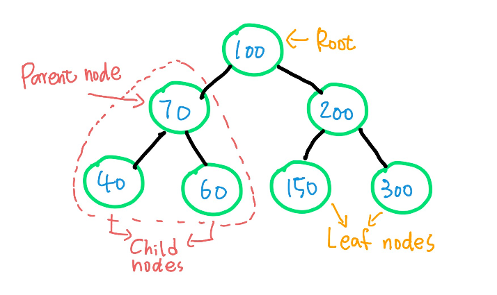
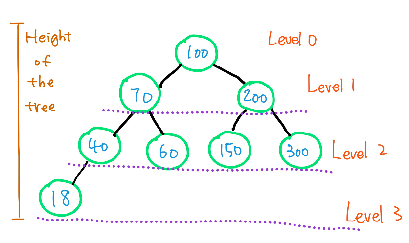

<!-- 
What is the purpose of the data structure?

What is the performance of the data structure (you will need to talk about big O notation)?

What kind of problems can be solved using the data structure?

How would the data structure be used in Python (in some cases you will need to discuss recursion)?

What kind of errors are common when using the data structure? -->
# Table of Contents - Tree
Tree
* Recursion
* Tree

Prove
* Coding Challenge
* Resolution

Resources

# Recursion


Figure 1 - Recursion

 Before we deep dive into tree, we need to learn recursion first.
 Recursion is a powerful technique in software development. It is often used in interviews for software developer positions. This method is to breaks down complex problems to small, simple, easily managed parts. 

When we use recursion, we must pay attention to the three laws: 

1. A recursive algorithm must have a base case.
2. A recursive algorithm must change its state and move toward the base case.
3. A recursive algorithm must call itself, recursively.

 

 Figure 2 - Law of Recursion

#
# Implementation
This is an example of recursion in action. We would like to create a finction to draw a same shape spiral. 
We first define the base case - The base case is the exit condition of the recursive algorithm. In line 15, when the line_length is greater than the max_length, the function will do nothing and return.
Second, we will need to decide what the small problem is, the small problem is to draw the spiral. And lastly, we need to use the recursive call. The function is being called which is the function we are currently using, We pass the length that increments, so that every time the function is call, we pass in an increased line length. 
[Example File](https://github.com/chloehuang18/Python-Data-Structure/blob/master/recursion.py)


 Figure 3 - Recursion Code

Here is the output


 Figure 4 - Recursion Output

#
# Tree
A tree is a data structure. Unlike the trees we see in the park that have the roota in the soil, in data structure, a tree is upside down that the root is on the top and then expand towards down. Tree is hierachical data structure. With this structure, we can seach for things easily. 

A binary tree is a data structur where every node has at most two children- left and righ. The root of a tree is on the top. 

* Node is the elementary of a binary tree
* Root is the top element iod a tree. Each tree only has one root
* Leaf is the node which has no children underneth 
* Parent is the node that is one level up of the node
* Child is one level down of a the node



* Level is the generation of the repective node. The root is level 0
* Balancing the tree makes for better search times O(log(n)) as opposed to O(n)


## Build a tree
1. Create node class
```python
class Node:

    def __init__(self, data):
        # left child
        self.left = None
        # right child
        self.right = None
        # node's value
        self.data = data
```

2.  Create the insert function that compares the values of the node and decides whether to add the value to the left node or right node.

```python
def insert(self, data):
    if self.data:
        if data < self.data:
            if self.left is None:
                self.left = Node(data)
            else:
                self.left.insert(data)
        elif data > self.data:
            if self.right is None:
                self.right = Node(data)
            else:
                self.right.insert(data)
    else:
        self.data = data  

```

## Search a tree
Search function uses recursion to find the target item on the left side and right side. 

```python
def search(self, target):
    if self.data == target:
        print("Found it")
        return self

    if self.left and self.data > target:
        return self.left.search(target)
    
    if selft.right and self.data < tatget:
        return self.right.search(target)
    
    print("Sorry the taget is not found")_
    
```

## Traversing a tree
 To search the node systematically, there are more than one way to traverse throught the tree. 

 We will introuduct the Preorder traverseal. In a preorder traversal, the root node is visited first, followed by the left child, then the right child.

 ```python
def traversePreorder(self):
    print(self.data):
    if self.left:
        self.left.traversePreorder
    if self.right:
        self.right.traversePreorder
 ``` 

## Performance 

|Performance |Tree Operation|
|-----|----|
|O(log(n)) | insert()  |
|O(log(n)) | remove()  |
|O(log(n)) | height()  |
|O(log(n)) | search()  |
|O(log(n)) | traverse()  |

# Implementation
### Example
```python
class Node:
   def __init__(self, data):
      self.left = None
      self.right = None
      self.data = data
"""
Compare the new value with the parent node
If the value of the data is less than current node, insert the data to the left
"""
    def insert(self, data):
	if self.root is None:
		self.root = BST.Node(data)
	else:
		self._insert(data, self.root)  # Start at the root

def _insert(self, data, node):
	if data < node.data:
		# the left side.
		if node.left is None:
			node.left = BST.Node(data)
		else:
			self._insert(data, node.left)
	elif data >= node.data:
		if node.right is None:
			node.right = BST.Node(data)
		else:
			self._insert(data, node.right)

# Print the tree
   def PrintTree(self):
      if self.left:
         self.left.PrintTree()
      print( self.data),
      if self.right:
         self.right.PrintTree()

# Use the insert method to add nodes
root = Node(10)
root.insert(6)
root.insert(15)
root.insert(2)
root.PrintTree()
```
Expect output: 
```python
2 6 10 15
```


#
### Real life examples
There are three importna la

1. Traversing hierarchical data structures: file systems, DOM tree
2. Data mining and database design and information retrieval
3. Most morden programming languages support recursion


#
# Prove
The first challenge is to use recursion to write a search function to search the target on the current node, left side of the tree, and right side of the tree. 
If the target is found, will print "Found it", otherwise print "Not found"o apply what we learn and write a search function to find the target value.
#
The second challenge is to write a function to count the height of the tree
You will need to count both side, and the return the number of the heighter side.
Write your own test case and return the number of the height.

Note: It is impoertant to have a balanced tree when using tree data structure. 
Finding heights for both sides can help us to see if the levela are unbalanced. If it's unbalanced we will need to rebalance the tree. 
#
### Challenage
Download [Tree Challenage](https://github.com/chloehuang18/Python-Data-Structure/blob/master/tree_challenge.py)

#
### Answer
Download [Tree Answer](https://github.com/chloehuang18/Python-Data-Structure/blob/master/tree_answer.py)

#
# Source
[Figure 1](https://prateekvjoshi.com/2013/10/05/understanding-recursion-part-i/)

[Turtle library -1](https://docs.python.org/3/library/turtle.html)

[Turtle library -2](https://realpython.com/beginners-guide-python-turtle/)

[Tree](https://www.educative.io/edpresso/binary-trees-in-python)